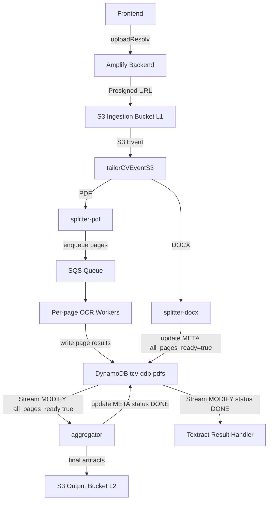

# Serverless CV Upload & Processing Pipeline – High‑Level Flow

This document describes the **end‑to‑end execution flow** of the CV upload and processing pipeline.
It focuses on **architecture, responsibilities, and event‑driven transitions**, while intentionally avoiding low‑level implementation details.

The objective is to clearly demonstrate **production‑grade system design** suitable for technical reviewers and job applications.

---

## Overall Architecture (Simplified)

---

## 1. Upload Initialization (Frontend → Backend)

The workflow starts when the frontend invokes the Amplify resolver:

**`uploadResolv`**

Responsibilities:

* Validates the upload request
* Creates initial document‑level metadata
* Initializes a tracking record in DynamoDB
* Returns pre‑signed S3 upload instructions

At this stage, the system establishes a **document identifier** and a **META record** that will act as the anchor for the entire pipeline.

---

## 2. Raw File Upload (Client → S3)

Using the pre‑signed URL, the client uploads the CV file directly to the **S3 ingestion bucket**.

This design:

* Keeps Lambdas stateless
* Avoids routing large files through compute
* Improves scalability and cost efficiency

The upload event marks the transition to a fully **event‑driven backend flow**.

---

## 3. Initial S3 Event Handling

An `ObjectCreated` event from S3 triggers the Lambda:

**`tailorCVEventS3`**

High‑level responsibilities:

* Registers the uploaded file
* Updates document metadata in DynamoDB
* Determines the processing path based on file type

Rather than invoking downstream functions directly, this Lambda **routes work by updating state** and delegating responsibility.

---

## 4. File Splitting Stage (Explicit)

Document splitting is handled by **specialized, format‑specific Lambdas**.

### 4.1 DOCX Splitter – `splitter-docx`

* Splits DOCX documents into page‑level units
* Produces normalized artifacts suitable for OCR
* Updates page‑level records in DynamoDB

### 4.2 PDF Splitter – `splitter-pdf`

* Splits PDFs into individual pages
* Converts each page into an image‑based representation
* Updates page‑level records in DynamoDB

After this stage, **each page becomes an independent unit of work**, enabling parallel processing.

---

## 5. Per‑Page OCR Processing (SQS‑Driven)

For each generated page:

* A message is sent to **Amazon SQS**
* Each message triggers a per‑page OCR worker Lambda

Each worker:

* Processes exactly one page
* Persists extracted text and metadata
* Updates page‑level state in DynamoDB

This stage scales horizontally and remains fully decoupled from document‑level logic.

---

## 6. DynamoDB as the Coordination Layer

All processing state is tracked in a single DynamoDB table:

**`tcv-ddb-pdfs`**

Key characteristics:

* Document‑level **META record**
* Page‑level records for fine‑grained progress tracking
* DynamoDB Streams enabled

Rather than using explicit orchestration services, **state transitions in DynamoDB drive the pipeline forward**.

---

## 7. Aggregation (DynamoDB Stream‑Driven)

A Lambda named:

**`aggregator`**

is triggered exclusively via **DynamoDB Streams**, using strict filters.

It runs only when:

* The document META record is modified
* All page‑level records indicate completion
* The document transitions into an aggregation‑ready state

Responsibilities:

* Aggregates page‑level outputs
* Produces a single consolidated document representation
* Writes derived artifacts to the output S3 bucket

This cleanly separates **parallel page processing** from **document‑level aggregation**.

---

## 8. Textract Result Handling (Stream‑Driven)

A dedicated **Textract Result Handler** Lambda is also attached to the DynamoDB Stream.

It is triggered only when:

* The META record is modified
* The document status transitions to `DONE`

Responsibilities:

* Consumes finalized OCR and aggregation outputs
* Prepares the document for downstream AI processing
* Updates final document state

This guarantees **deterministic, exactly‑once execution** at the document level.

---

## 9. Finalization & Output

Once processing completes:

* The document state is marked as complete
* Final artifacts are available in the output S3 bucket
* The frontend can safely retrieve results

The backend workflow ends without requiring synchronous coordination.

---

## Architectural Principles Demonstrated

This pipeline intentionally highlights:

* Event‑driven design using **S3, SQS, and DynamoDB Streams**
* Loose coupling via state‑based transitions
* Stateless Lambdas with single responsibilities
* Horizontal scalability without heavy orchestration
* A production‑ready alternative to monolithic Step Functions

---

## Why This Matters

This repository demonstrates:

* Real‑world AWS serverless design
* Advanced DynamoDB Stream filtering
* Clear separation of concerns
* Interview‑ready, explainable architecture

The focus is on **clarity, correctness, and architectural maturity**, not implementation noise.
